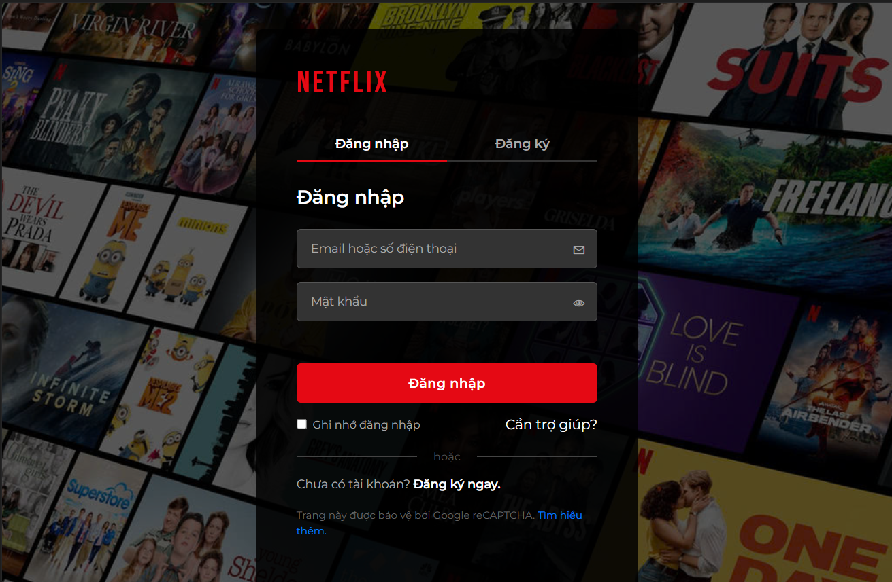
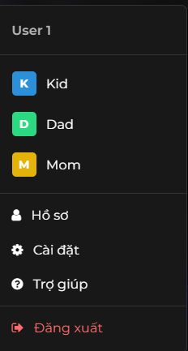
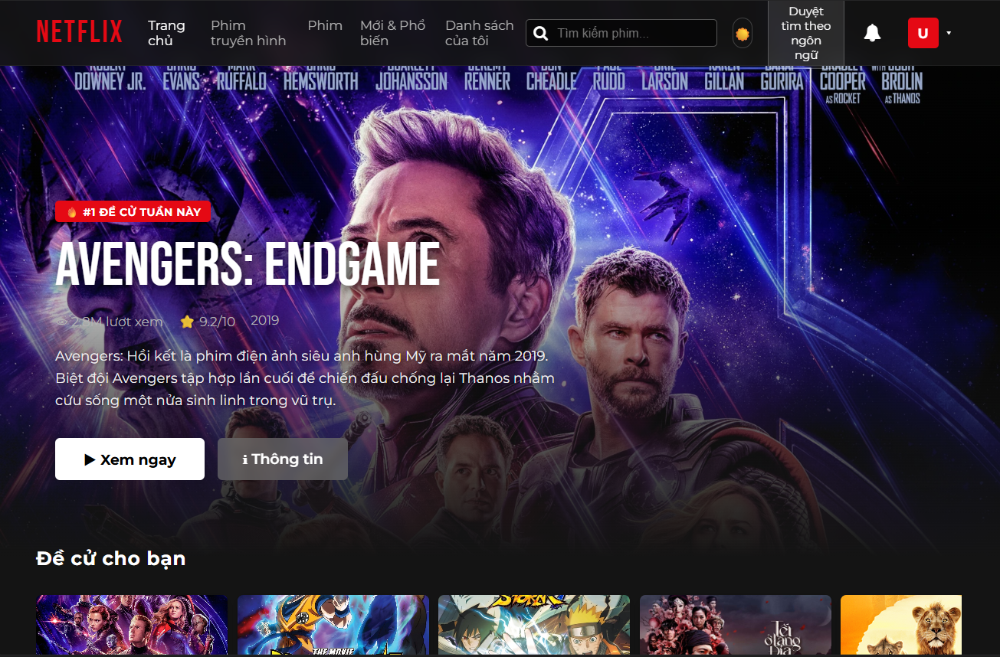
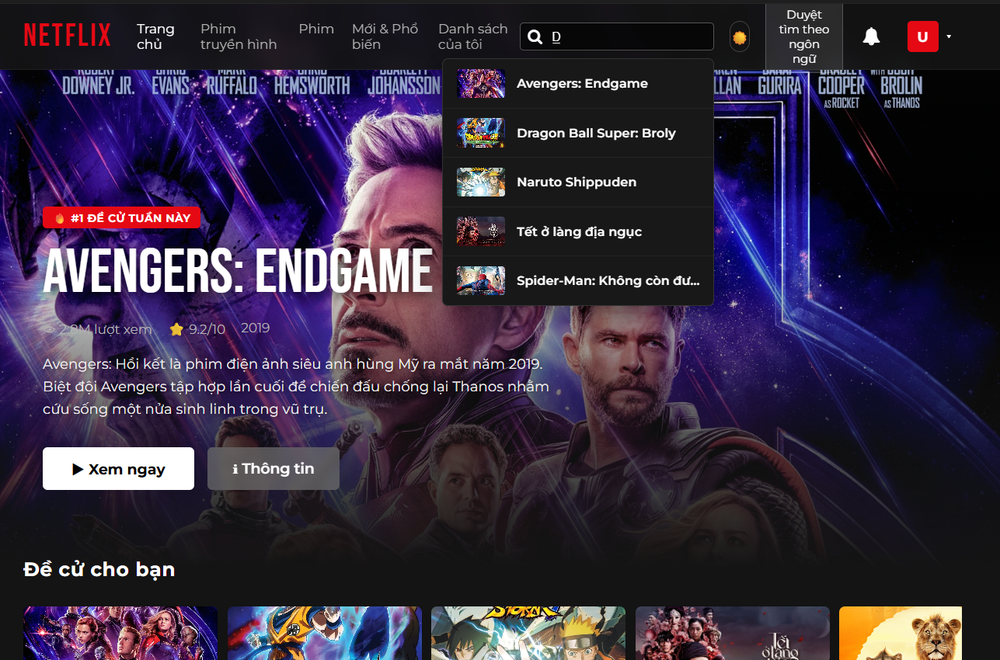
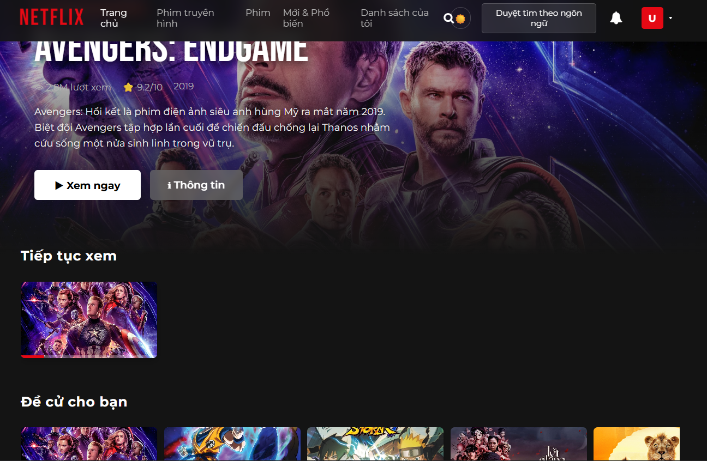
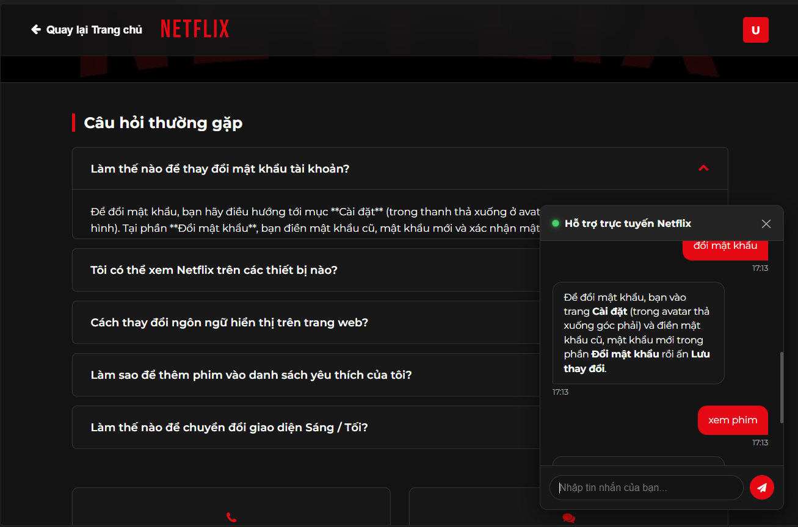

# 🎬 Netflix Clone - Premium Frontend Portfolio

[](https://developer.mozilla.org/)
[](https://www.themoviedb.org/)
[](https://developer.mozilla.org/)
[](LICENSE)

Một ứng dụng web phát trực tuyến video (movie streaming) với độ hoàn thiện cao (high-fidelity), lấy cảm hứng thiết kế từ **Netflix**. Dự án được lập trình hoàn toàn bằng **Vanilla HTML5, CSS3 và Javascript (ES6+)** thuần túy (no frameworks), tập trung tối đa vào tối ưu hóa UI/UX, tích hợp dữ liệu TMDB API thời gian thực và quản lý trạng thái client-side nâng cao. 

---
**Tài khoản test nhanh:** Người dùng có thể đăng nhập bằng bất kỳ tài khoản nào hoặc đăng ký tài khoản mới trực tiếp tại trang Login (dữ liệu được lưu cục bộ).

---

## 📸 Screenshots (Giao Diện Dự Án)

| 🔑 Màn hình Đăng Nhập (Login) | 👥 Lựa chọn Hồ sơ (Profile Selection) |
| :---: | :---: |
|  |  |
| *Giao diện tối giản, xác thực form thời gian thực.* | *Phân chia dữ liệu theo từng profile cá nhân.* |

| 🏠 Trang chủ (Homepage) | 🔍 Tìm kiếm thông minh (Autocomplete Search) |
| :---: | :---: |
|  |  |
| *Banner động hoành tráng, slider cuộn kéo mượt mà.* | *Debouncing 300ms lọc dữ liệu cực nhanh kèm ảnh gợi ý.* |

| 🎥 Trình xem phim & Đánh giá (Player & Reviews) | ⚙️ Cài đặt & Trợ giúp (Settings & Help Center) |
| :---: | :---: |
|  |  |
| *Player tùy biến, Resume xem tiếp dở dang & Đánh giá 5★.* | *Thay đổi theme Sáng/Tối, ngôn ngữ & chatbot hỗ trợ.* |

---

## 🌟 Tính Năng Nổi Bật (Key Features)

- [x] **Tích Hợp API TMDB & Cơ Chế Dự Phòng (TMDB V3 API & Automatic Fallback):**
  - Tự động lấy danh sách phim Đề cử (Trending), Phim bộ (TV Shows), Phim lẻ (Popular) và lọc theo Thể loại thời gian thực.
  - Tự động tìm nạp thông tin Đạo diễn, Diễn viên thực tế và trailer Youtube nhúng vào player.
  - **Đặc biệt:** Tích hợp cơ chế tự động chuyển sang dữ liệu phim tĩnh cục bộ (`shared/movies.js`) nếu TMDB API gặp lỗi mạng hoặc vượt hạn mức (Rate-limiting), giữ ứng dụng luôn hoạt động ổn định.
- [x] **Tìm Kiếm Gợi Ý Thông Minh & Trễ Phím (Debounced Search Autocomplete):**
  - Hiển thị danh sách kết quả gợi ý nhanh kèm ảnh Poster thu nhỏ ngay dưới ô input khi người dùng đang nhập.
  - Sử dụng kỹ thuật **Debounce (300ms)** giúp giảm tải số lượng request gọi lên server, tăng hiệu năng và tránh bị khóa IP do spam API.
- [x] **Theo Dõi Tiến Trình Xem & Tiếp Tục Xem (Continue Watching & Resume Playback):**
  - Lắng nghe các sự kiện video (`timeupdate`, `loadedmetadata`) để lưu lại tiến trình xem phim (phần trăm đã xem) theo thời gian thực.
  - Hiển thị danh sách "Tiếp tục xem" (Continue Watching Row) tại Trang chủ của từng hồ sơ với thanh tiến trình màu đỏ đặc trưng.
  - Hiển thị thông báo (Resume Modal) hỏi người dùng có muốn xem tiếp từ vị trí trước đó khi mở lại phim.
- [x] **Hệ Thống Đa Hồ Sơ Cá Nhân Hóa (Multi-profile System):**
  - Hỗ trợ tối đa 4 hồ sơ khác nhau (User 1, Kid, Dad, Mom).
  - Tách biệt hoàn toàn dữ liệu của từng hồ sơ: Danh sách phim yêu thích (My List) và lịch sử Xem tiếp dở dang đều được cá nhân hóa độc lập.
  - Cho phép chuyển đổi nhanh hồ sơ ngay tại Header của trang chủ.
- [x] **Hệ Thống Đánh Giá & Bình Luận Độc Lập (Unified Rating & Comment System):**
  - Người dùng có thể bình luận và đánh giá từ 1 đến 5 sao.
  - Điểm số đầu vào hệ 5 sao được tự động quy đổi đồng bộ sang thang điểm 10 của hệ thống và tính điểm trung bình hiển thị trực quan.
- [x] **Hỗ Trợ Đa Ngôn Ngữ & Dark/Light Mode:**
  - Hỗ trợ dịch toàn bộ giao diện song ngữ Anh - Việt linh hoạt thông qua thuộc tính dữ liệu `data-translate`.
  - Tự động chuyển đổi giao diện Sáng / Tối (Light & Dark theme) lưu lại trạng thái trong LocalStorage.
- [x] **Trải Nghiệm UX Cao Cấp:**
  - Hiệu ứng tải trang dạng khung xương chuyển động (**Skeleton Loading**) giúp cải thiện cảm giác tải nhanh (Perceived Performance).
  - Hệ thống thông báo **Toast Notification** tự động hiển thị mượt mà khi người dùng thêm/xóa phim khỏi danh sách yêu thích.

---

## 🛠️ Công Nghệ Sử Dụng (Tech Stack)

* **HTML5:** Sử dụng các thẻ ngữ nghĩa (Semantic tags) chuẩn SEO như `<header>`, `<main>`, `<section>`, `<nav>`, `<footer>` và trình phát video gốc `<video>`.
* **CSS3:** Tổ chức layout linh hoạt bằng CSS Grid và Flexbox. Sử dụng CSS Variables để làm tính năng Theme Switcher và các hiệu ứng Keyframe Animations mượt mà cho slider và modal.
* **Vanilla JavaScript (ES6+):** Xây dựng theo hướng Modular Design, xử lý bất đồng bộ (Async/Await), fetch API, quản lý DOM động, và các kỹ thuật xử lý sự kiện nâng cao (Debouncing, Custom Events).
* **LocalStorage & SessionStorage:** Giải pháp lưu trữ trạng thái người dùng (Profiles, Watch Progress, My List, Language, Theme, Reviews) trực tiếp dưới client, không cần backend phức tạp.

---

## 💾 Thiết Kế Cơ Sở Dữ Liệu Client-side (Client-side Data Schema)

Vì đây là một dự án thuần Frontend, toàn bộ dữ liệu trạng thái được thiết kế và lưu trữ khoa học trong `LocalStorage` và `SessionStorage` dưới cấu trúc JSON:

### 1. Quản lý Đăng nhập & Xác thực (`SessionStorage` / `LocalStorage`)
* Key: `netflix_user` hoặc `netflix_remember`
* Dữ liệu mẫu:
  ```json
  {
    "username": "ducanh151",
    "email": "ducanh@example.com"
  }
  ```

### 2. Danh sách Hồ sơ (`LocalStorage`)
* Key: `netflix_profiles`
* Trạng thái hồ sơ hoạt động: `netflix_active_profile`
* Dữ liệu mẫu:
  ```json
  [
    { "id": "p1", "name": "User 1", "avatar": "#E50914" },
    { "id": "p2", "name": "Kid", "avatar": "#2b90d9" }
  ]
  ```

### 3. Tiến trình xem phim của từng Hồ sơ (`LocalStorage`)
* Key: `netflix_progress_[profile_id]` (ví dụ: `netflix_progress_p1`)
* Dữ liệu mẫu:
  ```json
  [
    {
      "filmId": "movie_299534",
      "currentTime": 1240,
      "duration": 7200,
      "progressPercent": 17,
      "lastWatched": 1717088925430
    }
  ]
  ```

### 4. Danh sách phim yêu thích (`LocalStorage`)
* Key: `netflix_mylist`
* Dữ liệu mẫu: `["movie_299534", "tv_1399"]`

### 5. Hệ thống Đánh giá & Bình luận (`LocalStorage`)
* Key: `netflix_reviews_[film_id]` (ví dụ: `netflix_reviews_movie_299534`)
* Dữ liệu mẫu:
  ```json
  [
    {
      "name": "Dad",
      "avatar": "#2bd980",
      "stars": 5,
      "comment": "Bộ phim rất đáng xem, hành động kịch tính từ đầu đến cuối!",
      "time": "Vừa xong"
    }
  ]
  ```

---

## 📂 Cấu Trúc Thư Mục (Project Structure)

Mã nguồn được tổ chức sạch sẽ, phân chia module rõ ràng để dễ bảo trì và nâng cấp:

```text
netflix/
├── assets/                  # Tệp tin đa phương tiện tĩnh (Hình ảnh poster, logo, video demo)
├── shared/                  # Thư viện và Tiện ích dùng chung cho toàn bộ dự án
│   ├── api.js               # Quản lý giao tiếp TMDB API, mapping dữ liệu và fallback logic
│   ├── common.js            # Điều khiển cốt lõi (Xác thực, đa ngôn ngữ, theme, quản lý LocalStorage)
│   ├── movies.js            # Danh sách phim tĩnh cục bộ dùng làm dữ liệu dự phòng
│   ├── toast.js             # Logic tạo và hiển thị thông báo Toast Notification
│   └── toast.css            # Styling giao diện Toast Notification
├── login/                   # Module Đăng nhập & Đăng ký tài khoản
│   ├── login.html
│   ├── login.css
│   └── login.js
├── ho_so/                   # Giao diện chọn và quản lý các hồ sơ xem phim
│   ├── ho_so.html
│   ├── ho_so.css
│   └── ho_so.js
├── trang_chu/               # Giao diện chính của ứng dụng
│   ├── trang_chu.html
│   ├── trang_chu.css        # Bố cục chính, responsive thiết bị di động
│   └── trang_chu.js         # Lắng nghe sự kiện, quản lý Banner động, tìm kiếm debounced
├── xem_phim/                # Giao diện xem chi tiết phim và phát trailer/video
│   ├── modules/             # Các khối chức năng độc lập (Modular Scripting)
│   │   ├── videoPlayer.js   # Quản lý phát video, sự kiện tiến trình, overlay tiếp tục xem
│   │   ├── reviewSystem.js  # Hệ thống đánh giá sao, nhập bình luận và lưu trữ LocalStorage
│   │   └── recommendations.js # Slider phim đề xuất tương tự và tính năng drag-to-scroll
│   ├── xem_phim.html
│   ├── xem_phim.css
│   └── xem_phim.js          # Trang điều khiển chính (Page Controller) nạp dữ liệu phim
├── cai_dat/                 # Trang cài đặt tài khoản, thay đổi mật khẩu và theme
│   ├── cai_dat.html
│   ├── cai_dat.css
│   └── cai_dat.js
├── tro_giup/                # Trung tâm hỗ trợ FAQs tích hợp Chatbot tư vấn tự động
│   ├── tro_giup.html
│   ├── tro_giup.css
│   └── tro_giup.js
└── README.md
```

---

## 🚀 Hướng Dẫn Cài Đặt & Chạy Thử (Installation & Setup)

Vì đây là một trang web tĩnh thuần túy không dùng build-tools phức tạp, việc chạy thử dự án cực kỳ đơn giản và nhẹ nhàng:

1. **Clone dự án về máy tính của bạn:**
   ```bash
   git clone https://github.com/DucAnh151/Web-Netflix-Clone.git
   cd Web-Netflix-Clone
   ```

2. **Chạy thử dự án:**
   * Cách đơn giản nhất: Bạn chỉ cần click đúp mở trực tiếp tệp `login/login.html` bằng bất kỳ trình duyệt nào.
   * **Khuyên dùng:** Để trải nghiệm trọn vẹn các tính năng chuyển trang mượt mà và tránh lỗi bảo mật chính sách cookie/CORS cục bộ của trình duyệt, hãy cài đặt tiện ích mở rộng **Live Server** trong VS Code. Sau đó, nhấn chuột phải vào tệp `login/login.html` và chọn **Open with Live Server** (chạy tại cổng `http://127.0.0.1:5500`).

3. **Cài đặt API Key của riêng bạn (Tùy chọn):**
   * Dự án đã đi kèm một API Key demo có sẵn. Tuy nhiên, nếu bạn muốn dùng API Key của riêng mình:
   * Hãy truy cập [The Movie Database](https://www.themoviedb.org/), tạo tài khoản miễn phí và lấy **API Key (v3 auth)** trong trang cá nhân.
   * Mở tệp `shared/api.js` và thay thế giá trị hằng số `TMDB_API_KEY` ở dòng 14:
     ```javascript
     const TMDB_API_KEY = 'API_KEY_CỦA_BẠN';
     ```

---

## 💡 Thử Thách Kỹ Thuật & Giải Pháp (Challenges & Solutions)

Trong quá trình phát triển ứng dụng này, tôi đã gặp phải một số thử thách thú vị liên quan đến Frontend thuần và đã tìm ra các giải pháp giải quyết chuyên nghiệp:

### 1. Quản lý đồng bộ Trạng thái (State Synchronization) giữa nhiều trang HTML khác nhau
* **Thử thách:** Khi người dùng đổi profile xem phim hoặc ngôn ngữ ở Header trang chủ, làm thế nào để trang xem phim hoặc cài đặt nhận biết ngay sự thay đổi để tải lại đúng dữ liệu mà không sử dụng các thư viện như Redux hay React Context?
* **Giải pháp:** Sử dụng kết hợp **LocalStorage làm nguồn dữ liệu duy nhất (Single Source of Truth)** và kỹ thuật **Custom Events** của JavaScript. Khi một thay đổi xảy ra, một Custom Event được kích hoạt (ví dụ: `window.dispatchEvent(new Event('profilechanged'))`). Các trang con sẽ lắng nghe sự kiện này để cập nhật UI tự động mà không cần tải lại trang.

### 2. Tối ưu hóa hiệu năng gọi API Tìm kiếm (Search Performance Optimization)
* **Thử thách:** Ban đầu, hệ thống thực hiện gọi API TMDB với mỗi ký tự người dùng gõ vào ô tìm kiếm. Điều này tạo ra hàng chục request không cần thiết trong thời gian ngắn, gây chậm ứng dụng (giật lag giao diện gợi ý) và dễ bị TMDB khóa API Key do spam request.
* **Giải pháp:** Áp dụng kỹ thuật **Debounce** trong hàm tìm kiếm ở [trang_chu.js](file:///d:/Năm%203/PTUDWeb/netflix/trang_chu/trang_chu.js). Hàm gọi API chỉ thực sự được chạy sau khi người dùng ngừng gõ phím ít nhất **300ms**. Nếu người dùng tiếp tục gõ trước thời gian này, bộ hẹn giờ (timer) trước đó sẽ tự động bị xóa, giúp tiết kiệm hơn 70% số lượng request gọi lên máy chủ TMDB.

### 3. Đảm bảo tính sẵn sàng của dữ liệu (High Data Availability with Fallback Logic)
* **Thử thách:** TMDB API có thể bị chậm, mất mạng đột ngột hoặc hết hạn mức API key demo, dẫn đến việc trang chủ trống trơn và gây trải nghiệm tệ cho người dùng khi chấm điểm đồ án hoặc tuyển dụng.
* **Giải pháp:** Thiết kế lớp API wrapper tại [api.js](file:///d:/Năm%203/PTUDWeb/netflix/shared/api.js) sử dụng cấu trúc `try...catch` bao bọc mọi cuộc gọi mạng. Nếu có lỗi mạng hoặc API bị từ chối, khối `catch` sẽ tự động chuyển hướng lấy dữ liệu thay thế từ danh sách phim cục bộ chuẩn hóa (`shared/movies.js`), giúp trang web chạy mượt mà ngay cả khi ngoại tuyến (offline).

---

## 🔮 Hướng Phát Triển Tương Lai (Future Improvements)

* [ ] **Di chuyển sang React / Next.js:** Chuyển đổi mã nguồn sang React để tận dụng mô hình Component-based giúp tái sử dụng các Slider, Card, Button và tối ưu hóa SEO bằng Server-Side Rendering (SSR).
* [ ] **Bổ sung Backend (Node.js / Express / MongoDB):** Xây dựng server riêng để lưu trữ tài khoản người dùng thực tế, lưu lịch sử xem phim trên database thay vì LocalStorage giúp bảo mật thông tin.
* [ ] **Truyền tải video thích ứng (Adaptive Video Streaming):** Thay thế video phát tĩnh bằng giao thức HLS (`.m3u8`) hoặc MPEG-DASH để tự động thay đổi độ phân giải video dựa trên tốc độ mạng của người dùng.

---

## 👤 Tác Giả (Author)

* **Họ và tên:** *Phạm Đức Anh*
* **Vị trí mong muốn:** Frontend Intern / Junior Frontend Developer
* **GitHub:** [DucAnh151](https://github.com/DucAnh151)
* **Email:** *pducanh151204@gmail.com*
* **LinkedIn:** *www.linkedin.com/in/ducanhpahm1525*

---
*Cảm ơn bạn đã xem qua dự án của tôi. Nếu bạn thấy thú vị, xin hãy dành tặng tôi một ⭐️ trong kho lưu trữ GitHub này nhé!*
